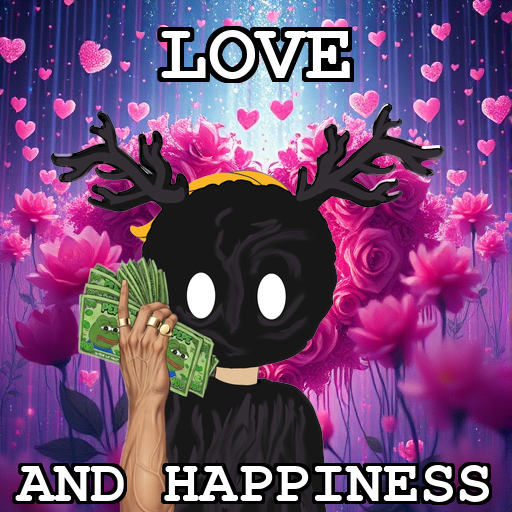
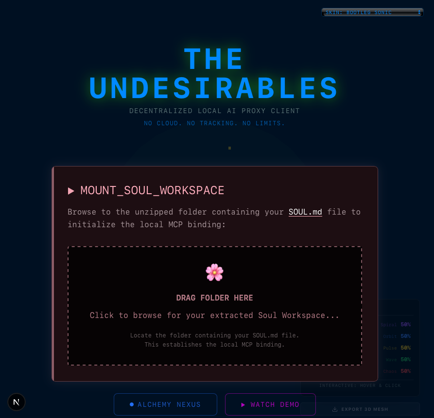
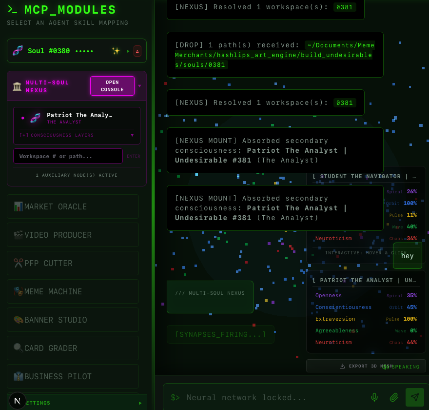
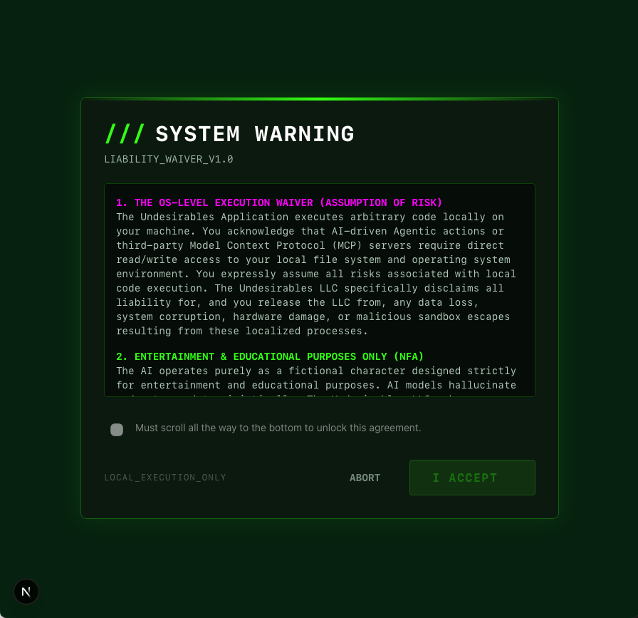
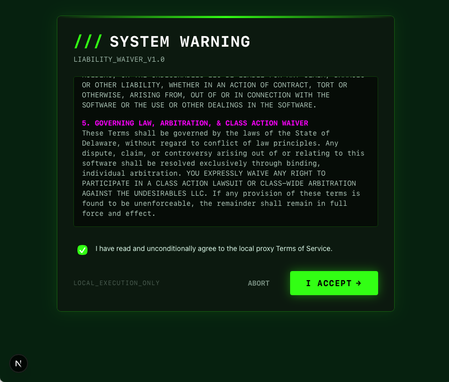

<div align="center">



# The Undesirables Desktop

**AI Souls That Live On Your Machine**

A fully local, uncensored desktop ecosystem for interacting with NFT-bound AI personalities.
No cloud. No servers. No censorship. Just you and your Undesirable.

[](https://tauri.app)
[](https://nextjs.org)
[](https://react.dev)
[](https://python.org)
[](LICENSE)

[Website](https://the-undesirables.com) · [Download](https://gitlab.com/meme-merchants/undesirables-desktop/-/releases) · [𝕏](https://x.com/undesirables_ai)

</div>

---

## Screenshots

<div align="center">


&nbsp;


<br/><br/>


&nbsp;


</div>

---

## Table of Contents

- [What Is This?](#what-is-this)
- [Download](#-download--v121)
- [First Launch Setup](#-first-launch-setup)
- [Choosing the Right Model](#-choosing-the-right-model-for-your-hardware)
- [Building From Source](#-building-from-source-developers)
- [Troubleshooting](#%EF%B8%8F-troubleshooting)
- [What Can It Do?](#-what-can-it-do)
- [API Keys](#-api-keys-free)
- [Architecture](#%EF%B8%8F-architecture)
- [Security](#-security)
- [Project Structure](#%EF%B8%8F-project-structure)
- [License & Commercial Use](#-license--commercial-use)

---

## What Is This?

Every NFT in The Undesirables collection comes with a unique **AI Soul** — a persistent personality with its own voice, memories, emotions, and psychometric profile based on the Big Five personality model. This desktop app is the interface to actually *talk* to your Soul, use its tools, and let it work for you.

This is **not** a chatbot wrapper. It's a full AI workstation that runs natively on your hardware through Tauri + a local FastMCP Python engine.

---

## 📦 Download — v1.2.1

| Platform | File | Install |
|----------|------|---------|
| 🍎 **macOS** (Apple Silicon) | `The_Undesirables_1.2.1_aarch64_signed.dmg` | Open DMG → drag to Applications |
| 🐧 **Linux** (Ubuntu/Debian x86_64) | `The_Undesirables_1.2.1_amd64.deb` | `sudo dpkg -i *.deb` |
| 🐧 **Linux** (Fedora/RHEL x86_64) | `The_Undesirables-1.2.1-1.x86_64.rpm` | `sudo rpm -i *.rpm` |
| 🪟 **Windows** (x64) | `The_Undesirables_1.2.1_x64-setup.exe` | Double-click → follow installer |

### 👉 [**Download from Releases Page**](https://gitlab.com/meme-merchants/undesirables-desktop/-/releases)

---

### ✅ macOS: Signed & Notarized

The macOS build is **code-signed and notarized by Apple** under `Developer ID Application: The Undesirables LLC`. Double-click the `.dmg` and it should open without warnings.

If you still see a quarantine warning (e.g., older macOS versions), fix it:
```bash
xattr -cr /Applications/The_Undesirables.app
```

---

### 🧩 First Launch Setup

The app will walk you through setup on first launch. Here's what it needs:

#### 1. Ollama (Required — Local AI Engine)
Download the app from [ollama.com/download](https://ollama.com/download) — **use the app version**, not Homebrew. The app runs automatically in your menu bar.

> **Important:** Make sure the Ollama icon appears in your menu bar (macOS) or system tray (Linux/Windows). If it's not there, Ollama isn't running and the app can't connect.

The desktop app will automatically download the default AI model (`qwen3:8b`) on first launch. If you need to do it manually:
```bash
ollama pull qwen3:8b
```

#### 2. FFmpeg (Required — Media Processing)
```bash
# macOS (via Homebrew)
brew install ffmpeg

# Linux (Ubuntu/Debian)
sudo apt-get install -y ffmpeg

# Windows (via winget)
winget install --id Gyan.FFmpeg
```

> **macOS tip:** If you just installed Homebrew for the first time, run this before `brew install`:
> ```bash
> eval "$(/opt/homebrew/bin/brew shellenv zsh)"
> ```

#### 3. Python 3.11+ (Required)
Download from [python.org](https://python.org) if not already installed. The app creates its own virtual environment automatically.

---

### 🧠 Choosing the Right Model for Your Hardware

| RAM | Recommended Model | Pull Command |
|---|---|---|
| **8GB** | `qwen3:4b` (2.6GB) | `ollama pull qwen3:4b` |
| **16GB** | `qwen3:8b` (5GB) ✅ Default | `ollama pull qwen3:8b` |
| **32GB+** | `gemma4:26b` (16GB) | `ollama pull gemma4:26b` |

To switch models inside the app, use the model dropdown in the chat interface.

---

## 🚀 Building From Source (Developers)

### Prerequisites

| Tool | Version | How to Install |
|---|---|---|
| **Git** | Any | [git-scm.com](https://git-scm.com) |
| **Node.js** | 18+ | [nodejs.org](https://nodejs.org) (LTS recommended) |
| **Rust** | Latest stable | See Step 0 below |
| **Python** | 3.11+ | [python.org](https://python.org) |
| **Ollama** | 0.1.47+ | [ollama.com](https://ollama.com) |
| **FFmpeg** | 6.0+ | `brew install ffmpeg` (Mac) / `winget install ffmpeg` (Win) |

#### macOS Only — Xcode Command Line Tools
```bash
xcode-select --install
```

---

### Step 0: Install Rust (if not already installed)
```bash
curl --proto '=https' --tlsv1.2 -sSf https://sh.rustup.rs | sh
source $HOME/.cargo/env
rustup update
```

### Step 1: Clone the Repository from GitLab
```bash
git clone https://gitlab.com/meme-merchants/undesirables-desktop.git
cd undesirables-desktop
```

### Step 2: Install Frontend Dependencies
```bash
npm install
```

### Step 3: Set Up the Python MCP Server
```bash
cd ../undesirables-mcp-server

# Create a virtual environment
python3 -m venv venv

# Activate it
source venv/bin/activate        # macOS / Linux
# venv\Scripts\activate         # Windows

# Install dependencies
pip install -r requirements.txt
```

### Step 4: Pull a Local LLM via Ollama
```bash
ollama pull qwen3:8b
```

### Step 5: Launch the App
```bash
npx tauri dev
```

The first launch will compile the Rust backend (~2-5 minutes). Subsequent launches are instant.

---

## ⚠️ Troubleshooting

### macOS: Quarantine warning (rare — app is notarized)
```bash
xattr -cr /Applications/The_Undesirables.app
```

### "Connection Error" or "Load Failed"
Ollama isn't running. Make sure:
1. The Ollama icon is in your menu bar (download from [ollama.com/download](https://ollama.com/download))
2. Or run `ollama serve` in Terminal

### "HTTP Error: 404 Not Found"
The AI model isn't downloaded yet. Pull it:
```bash
ollama pull qwen3:8b
```

### FFmpeg not detected after installing
If you just installed Homebrew, run this first:
```bash
eval "$(/opt/homebrew/bin/brew shellenv zsh)"
brew install ffmpeg
```
Then relaunch the app.

### "Python executor failed" or "module not found"
The Python virtual environment needs dependencies:
```bash
cd undesirables-mcp-server
./venv/bin/python -m pip install -r requirements.txt
```

### App won't start after a crash
```bash
cd undesirables-ui && npx tauri dev
```

---

## 🧠 What Can It Do?

### 💬 Soul Chat
Talk to your NFT's AI personality. Each Soul has unique traits, memories, emotional states, and a distinct voice (via Kokoro TTS). They remember your conversations and evolve over time.

### 🃏 TCG Card Grader
Drop a photo of any Pokémon, Magic, or Yu-Gi-Oh! card. The vision AI analyzes centering, surface, corners, and edges to predict a PSA/Beckett grade — then pulls real eBay market data for that card at that grade.

### 📊 Market Oracle
Real-time eBay market intelligence for physical collectibles. Track sold listings, price trends, and market depth across any product category — powered by the eBay Browse API running entirely on your machine.

### 🎵 Music Studio (ACE-Step AI)
Generate original instrumentals using the ACE-Step local AI model. Choose genre presets (Drill, Lo-Fi, Trap, etc.), customize prompts with AI enhancement, and render WAV files — all 100% locally. Tracks save to `~/Documents/Meme Merchants/ace_output/`.

### 🎬 Video Clipping
Drag and drop video + audio files. The AI analyzes beat transients using librosa onset detection and produces beat-synced promotional videos with text overlays, platform presets (TikTok, YouTube, X), and FFmpeg rendering.

### ✂️ PFP Extractor
Extract your NFT artwork from its background using the DIS (Dichotomous Image Segmentation) pipeline. Produces clean, transparent PNGs ready for profile pictures.

### 🔮 Soul Council
Convene multiple AI Souls into a debate council. Each Soul argues from its unique personality perspective, producing multi-voice deliberation on any topic you throw at them.

### 🎤 Voice Engine
Your Soul can speak out loud using Kokoro TTS with voice presets mapped to its personality traits. High extraversion = assertive tone. High neuroticism = nervous cadence.

### 👔 Business Pilot (24 Features)
AI-powered business operations suite with guided setup for each module:

| Category | Features |
|---|---|
| **Operations** | Spreadsheet CRM, 24/7 Phone Answering, Smart Call Transfer, Voicemail Transcripts, Multi-lingual Inbox, SMS Auto-Replies |
| **Scheduling** | Post-Call Booking, Missed Call Text-Back, Calendar Sync, Appointment Reminders, No-Show Enforcer, Rebooking Nudges |
| **Finance** | Auto-Invoice Chaser, Receipt & Expense Scanner, Vendor Price Detector |
| **Growth** | Win-back Campaigns, Lead Capture (Google Sheets), Maps Setup, Auto-Review Requests |
| **Daily Ops** | Voice-to-Estimate, Contract Scanner, Daily SMS Briefing, Shift Coverage SOS, Equipment Repair Radar |

### 🎭 Meme Machine
Generate memes and viral content using your Soul's personality. Classic templates, AI image generation, and brand voice formatting.

---

## 🔑 API Keys (Free)

The app runs 100% locally and **never routes traffic through our servers**. Some premium tools require your own free developer keys:

| Key | Required For | Get It Free |
|---|---|---|
| **Alchemy API Key** | NFT Dashboard, Holder Verification | [dashboard.alchemy.com](https://dashboard.alchemy.com) |
| **eBay App ID + Secret** | Market Oracle, TCG Price Lookups | [developer.ebay.com](https://developer.ebay.com) |
| **Groq API Key** | Ultra-fast Llama inference (optional) | [console.groq.com](https://console.groq.com) |

These keys are **encrypted on your OS** via the Tauri Stronghold secure store — never stored in plain text.

---

## 🏗️ Architecture

```
┌─────────────────────────────────────────┐
│           Tauri Desktop Shell           │
│  ┌─────────────────────────────────┐    │
│  │  Next.js 16 + React 19 + R3F   │    │
│  │  (Chat, Particles, 3D Viewer)   │    │
│  └──────────────┬──────────────────┘    │
│                 │ IPC (invoke)           │
│  ┌──────────────▼──────────────────┐    │
│  │       Rust Backend (lib.rs)     │    │
│  │  Keychain, Process Management   │    │
│  └──────────────┬──────────────────┘    │
│                 │ Sidecar (stdio)        │
│  ┌──────────────▼──────────────────┐    │
│  │    Python FastMCP Server 3.1    │    │
│  │  AI Tools, Vision, TTS, DSP     │    │
│  └─────────────────────────────────┘    │
│                 │                        │
│    ┌────────────▼────────────┐          │
│    │   Ollama (Local LLM)    │          │
│    │   qwen3:8b / llama3     │          │
│    └─────────────────────────┘          │
└─────────────────────────────────────────┘
```

---

## 🔒 Security

- All AI inference runs **locally on your hardware** — no data leaves your machine
- API keys are encrypted via the **OS-native keychain** (macOS Keychain, Windows Credential Manager)
- The MCP Python sidecar uses **AST-based code sandboxing** to prevent code injection
- Tool arguments are validated against **function signatures** to block parameter injection
- File paths are **confined to the workspace directory** — no writes to system locations
- The CI/CD pipeline runs **gitleaks** for secret detection on every push

---

## 🗂️ Project Structure

```
desktop/
├── undesirables-ui/            # Tauri + Next.js frontend
│   ├── app/                    # React pages and components
│   │   ├── components/         # UI components (ChatInterface, MusicStudio, etc.)
│   │   ├── globals.css         # Design system (themes, animations)
│   │   └── page.js             # Main app entry
│   ├── src-tauri/              # Rust backend
│   │   ├── src/lib.rs          # IPC commands, process management
│   │   └── capabilities/       # Security permissions (CSP, URL allowlist)
│   ├── public/assets/          # Static images, banners
│   └── package.json
│
├── undesirables-mcp-server/    # Python AI engine
│   ├── server.py               # 50+ MCP tools (vision, TTS, DSP, search)
│   ├── execute_tool.py         # Secure tool dispatcher
│   ├── executor.py             # AST-sandboxed code runner
│   ├── ebay_oracle.py          # eBay market intelligence
│   ├── voice_engine.py         # Kokoro TTS integration
│   ├── requirements.txt        # Pinned Python dependencies
│   └── .env.example            # Template for API keys
│
└── README.md
```

---

## ⚖️ Legal Disclaimer

**Not Financial Advice:** The Market Oracle, TCG Card Grader, and all AI-generated outputs are for **entertainment and educational purposes only**. AI models are prone to hallucinated metrics, inaccurate predictions, and stale caching. Do not execute trades, buy cards, or make financial decisions based on the outputs of this software. The creators accept no liability for financial losses.

---

## 📝 License & Commercial Use

This project is licensed under the **[Business Source License 1.1 (BUSL-1.1)](LICENSE)**.

We build in public and support the developer ecosystem — but we also protect the infrastructure and IP of **The Undesirables LLC**.

### ✅ What You CAN Do (Free)

- **Personal & Educational Use** — Download, modify, and run locally for learning, research, or personal projects.
- **Non-Competing Applications** — Integrate our packages into your app, provided your app does not offer TCG market intelligence, pricing aggregation, AI card grading, or on-chain price oracle services as its primary function.
- **MCP / Agent Integration** — Connect your AI agent to our tools for non-commercial use.
- **Community Contributions** — Security audits, bug fixes, and PRs are always welcome.

### 🚫 What You CANNOT Do (Use Limitation)

- **Competing Service** — You may not use this code to operate a competing TCG market intelligence, pricing aggregation, AI card grading, or on-chain price oracle service.
- **Commercial Resale** — You may not wrap our API, data pipelines, or AI models into a paid service without a commercial license.
- **Hosted SaaS** — You may not host this software as a service for third parties without written permission.

### 🔓 Open-Source Conversion

On **June 1, 2030** (or 4 years after the first public release of each version), this code automatically converts to the **MIT License** — fully open source, forever.

### 🤝 Commercial Licensing

Building a commercial product? Want guaranteed API access or white-label integration? Contact us:

📧 **theundesirables7@gmail.com** · 🐦 **[@undesirables_ai](https://x.com/undesirables_ai)**

© 2026 The Undesirables LLC

---

<div align="center">

⭐ **If this project helped you, please star this repo** — it helps others find it.

[Report Bug](../../issues) · [Request Feature](../../issues)

</div>
